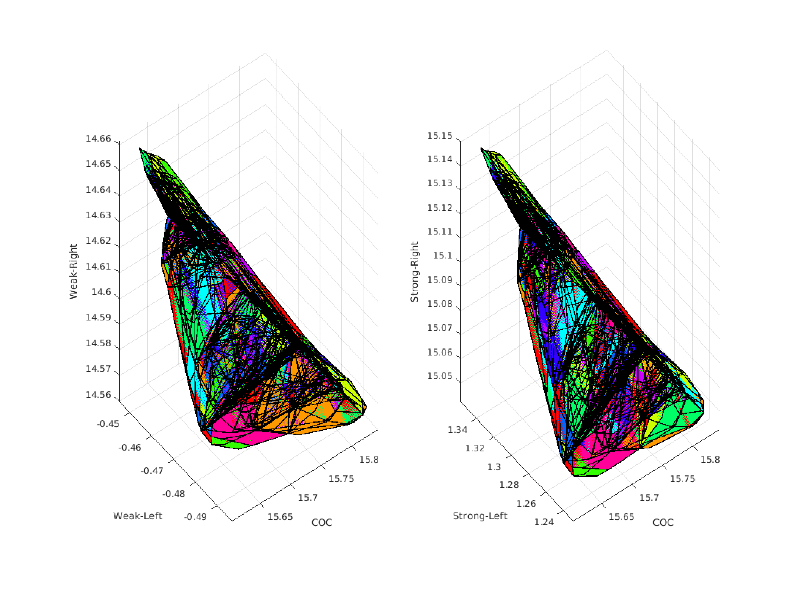
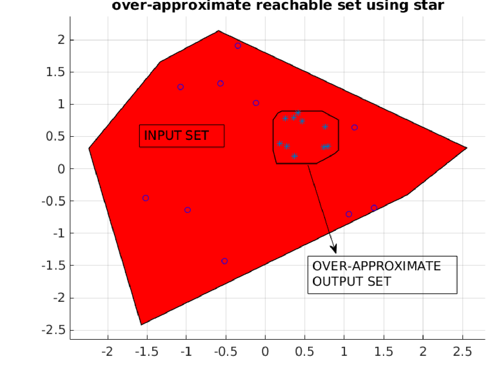
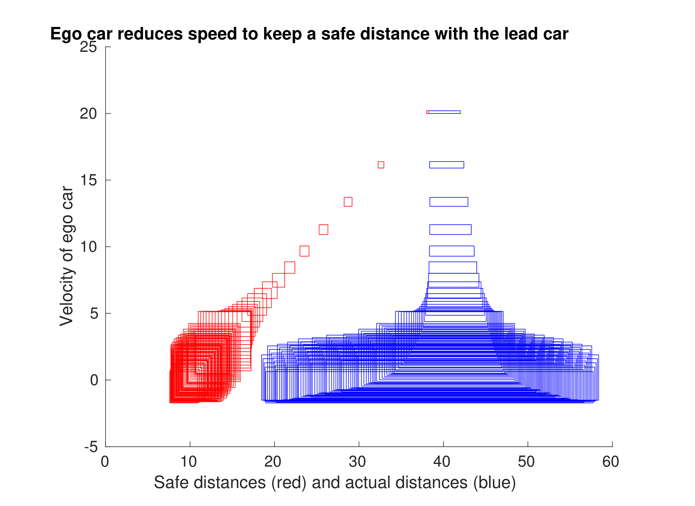
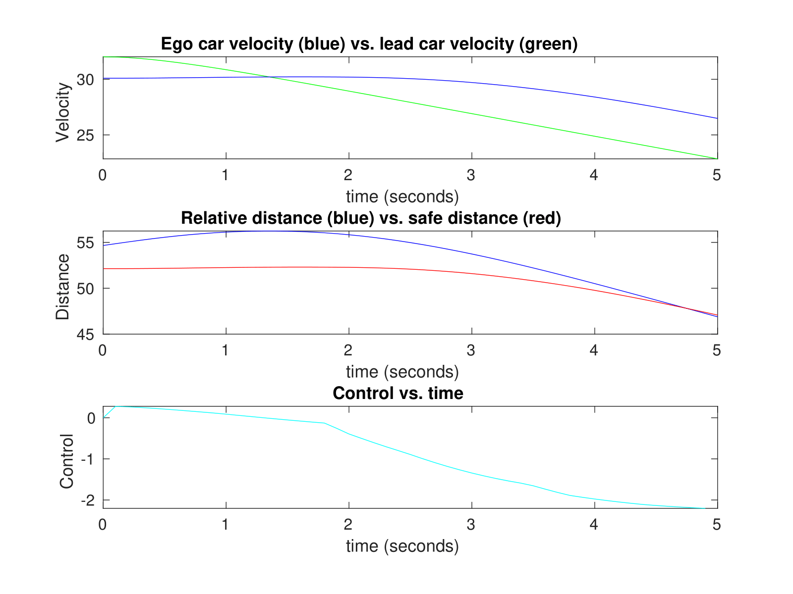
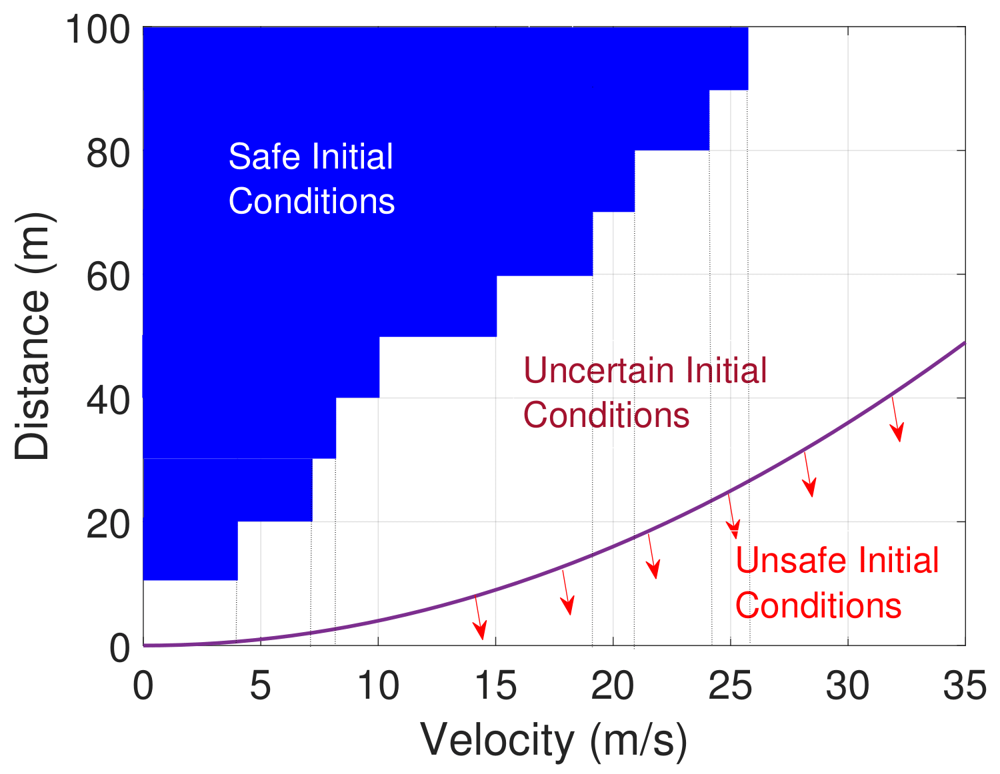

# nnv
Matlab Toolbox For Neural Network Verification

This toolbox implements reachability methods for analyzing neural networks, particularly with a focus on closed-loop controllers in autonomous cyber-physical systems (CPS).

# related tools and software

This toolbox makes use of the neural network model transformation tool ([nnmt](https://github.com/verivital/nnmt)) and for closed-loop systems analysis, the hybrid systems model transformation and translation tool ([HyST](https://github.com/verivital/hyst)).

# installation:
    1) install matlab

    2) clone or download nnv toolbox from https://github.com/trhoangdung/nnv

    3) open matlab, then go to ../nnv0.1/ run install.m script

# uninstallation:

    1) open matlab, then go to ../nnv0.1/ run uninstall.m script

# running tests and examples

    go into tests/examples folders to run the scripts for testing/analyzing examples.

# novel features

1) NNV can compute and visualize the exact reachable sets of feedforward nerual networks with ReLU/Saturation activation functions.

<figure>
     <figcaption>Vertical view of a generic example of the ACAS Xu benchmark set</figcaption>
</figure>

<figure>
     <figcaption>Exact reachable set of a ACAS Xu network</figcaption>
</figure>

<figure>
     <figcaption>Reachable set of a ACAS Xu network with different methods</figcaption>
</figure>

2) NNV can construct and visualize the complete counter inputs of feedforward neural networks with ReLU/Saturation activation functions.

<figure>
     <figcaption>An Complete Set of Counter Inputs of a ACASXu network</figcaption>
</figure>

3) NNV can compute and visualize the over-approximate reachable sets of feedforward neural networks with Tanh, Sigmoid activation functions.

<figure>
     <figcaption>Reachable set of a network with Sigmoid activation functions</figcaption>
</figure>

4) NNV can compute and visualize the reachable sets of neural network control systems, i.e., systems with plant + neural network controllers which can be used to verify or falsify safety properties of the systems.

<figure>
     <figcaption>Neural Network Adaptive Cruise Control System</figcaption>
</figure>

<figure>
     <figcaption>Reachable set of the neural network adaptive cruise control system</figcaption>
</figure>

<figure>
     <figcaption>A fasification trace of the neural network adaptive cruise control system</figcaption>
</figure>

<figure>
     <figcaption>Advaced Emergency Braking System with Reinforcement Controller</figcaption>
</figure>

<figure>
     <figcaption>Reachable set of the advanced emergency braking system with reinforcement controller</figcaption>
</figure>

<figure>
     <figcaption>Safe initial condition of the advanced emergency braking system with reinforcement controller</figcaption>
</figure>

# contributors

* [Hoang-Dung Tran](https://scholar.google.com/citations?user=_RzS3uMAAAAJ&hl=en)
* [Weiming Xiang](https://scholar.google.com/citations?user=Vm_7JP8AAAAJ&hl=en)
* [Patrick Musau](https://scholar.google.com/citations?user=C2RS3i8AAAAJ&hl=en)
* [Diego Manzanas Lopez](https://scholar.google.com/citations?user=kgpZCIAAAAAJ&hl=en)
* Xiaodong Yang
* [Luan Viet Nguyen](https://luanvietnguyen.github.io)
* [Taylor T. Johnson](http://www.taylortjohnson.com)

# references

The methods implemented in this toolbox are based upon the following papers.

1. Hoang-Dung Tran, Patrick Musau, Diego Manzanas Lopez, Xiaodong Yang, Luan Viet Nguyen, Weiming Xiang, Taylor T.Johnson, "Star-Based Reachability Analsysis for Deep Neural Networks", Submitted to The 23rd International Symposisum on Formal Methods (3rd World Congress on Formal Methods, FM2019).

2. Hoang-Dung Tran, Feiyang Cei, Diego Manzanas Lopez, Taylor T.Johnson, Xenofon Koutsoukos, "Safety Verification of Cyber-Physical Systems with Reinforcement Learning Control", Submitted to The International Conference on Embedded Software 2019, (EMSOFT2019).

3. Hoang-Dung Tran, Patrick Musau, Diego Manzanas Lopez, Xiaodong Yang, Luan Viet Nguyen, Weiming Xiang, Taylor T.Johnson, "Parallelzable Reachability Analsysis Algorithms for FeedForward Neural Networks", In 7th International Conference on Formal Methods in Software Engineering (FormaLISE), 27, May, 2019 in Montreal, Canada

4. Weiming Xiang, Hoang-Dung Tran, Taylor T. Johnson, "Output Reachable Set Estimation and Verification for Multi-Layer Neural Networks", In IEEE Transactions on Neural Networks and Learning Systems (TNNLS), 2018, March. [http://taylortjohnson.com/research/xiang2018tnnls.pdf]

5. Weiming Xiang, Hoang-Dung Tran, Taylor T. Johnson, "Reachable Set Computation and Safety Verification for Neural Networks with ReLU Activations", In In Submission, IEEE, 2018, September. [http://www.taylortjohnson.com/research/xiang2018tcyb.pdf]

6. Weiming Xiang, Diego Manzanas Lopez, Patrick Musau, Taylor T. Johnson, "Reachable Set Estimation and Verification for Neural Network Models of Nonlinear Dynamic Systems", In Unmanned System Technologies: Safe, Autonomous and Intelligent Vehicles, Springer, 2018, September. [http://www.taylortjohnson.com/research/xiang2018ust.pdf]

7. Reachability Analysis and Safety Verification for Neural Network Control Systems, Weiming Xiang, Taylor T. Johnson [https://arxiv.org/abs/1805.09944]

8. Specification-Guided Safety Verification for Feedforward Neural Networks, Weiming Xiang, Hoang-Dung Tran, Taylor T. Johnson [https://arxiv.org/abs/1812.06161]

9. Diego Manzanas Lopez, Patrick Musau, Hoang-Dung Tran, Taylor T.Johnson, "Verification of Closed-loop Systems with Neural Network Controllers (Benchmark Proposal)", The 6th International Workshop on Applied Verification of Continuous and Hybrid Systems (ARCH2019. Montreal, Canada, 2019.

# acknowledgements

This work is supported in part by the [DARPA Assured Autonomy](https://www.darpa.mil/program/assured-autonomy) program.
