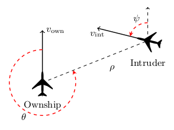
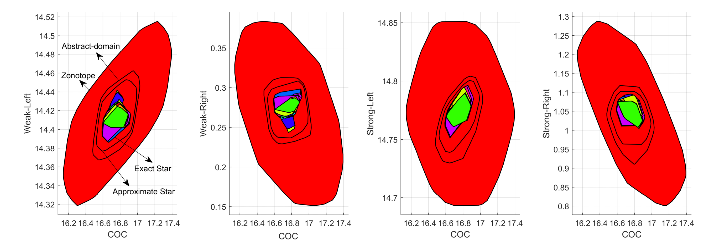
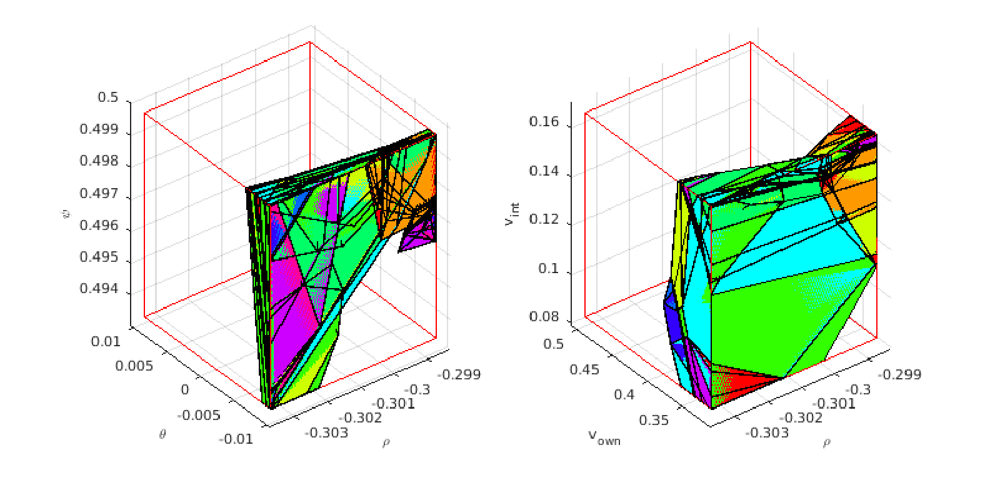
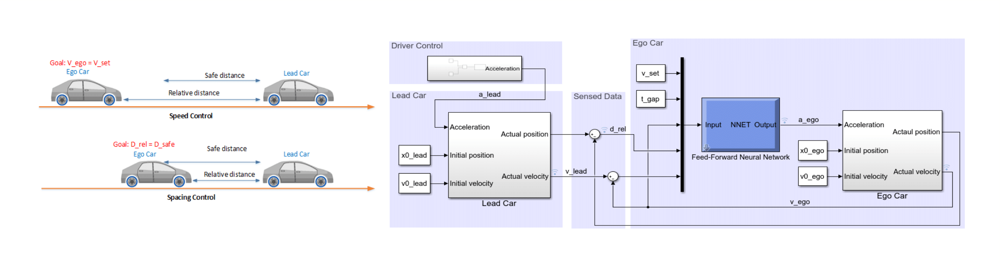
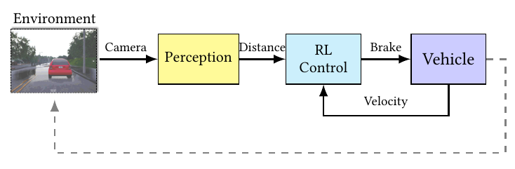
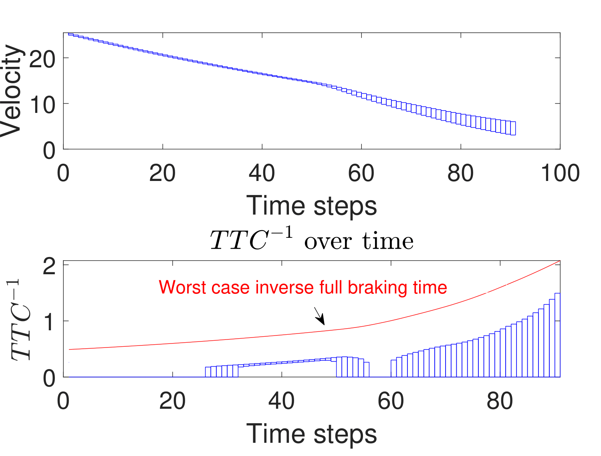
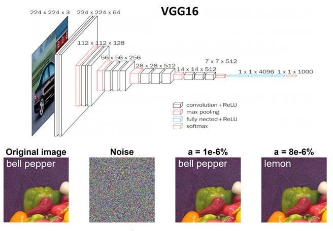
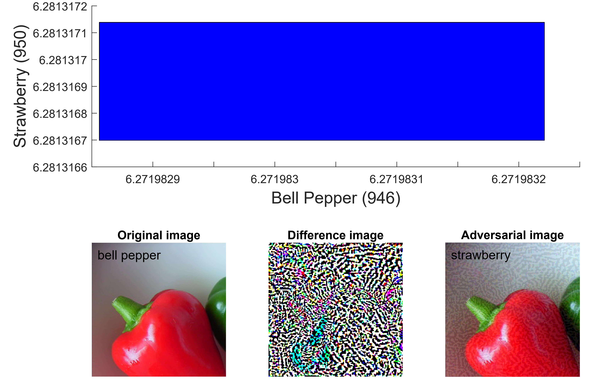

# nnv
Matlab Toolbox for Neural Network Verification

This toolbox implements reachability methods for analyzing neural networks, particularly with a focus on closed-loop controllers in autonomous cyber-physical systems (CPS).

# related tools and software

This toolbox makes use of the neural network model transformation tool ([nnmt](https://github.com/verivital/nnmt)) and for closed-loop systems analysis, the hybrid systems model transformation and translation tool ([HyST](https://github.com/verivital/hyst)).

# execution without installation:
nnv can be executed online without installing Matlab or other dependencies through [CodeOcean](https://www.codeocean.com) via the CodeOcean capsule DOI 10.24433/CO.1314285.v1: (https://doi.org/10.24433/CO.1314285.v1)

# installation:
    1) Install Matlab

    2) Clone or download the nnv toolbox from (https://github.com/verivital/nnv)

    3) Open matlab, then go to the directory where nnv exists on your machine, then run the `install.m` script located at /nnv/

    4) To run verification for convolutional neural networks you may need additional packages installed

       4-1) https://www.mathworks.com/matlabcentral/fileexchange/61733-deep-learning-toolbox-model-for-vgg-16-network  

       4-2) https://www.mathworks.com/help/deeplearning/ref/vgg19.html

# uninstallation:

    1) Open matlab, then go to `/nnv/` and execute the `uninstall.m` script

# running tests and examples

    Go into the `tests/examples` folders to execute the scripts for testing/analyzing examples.

# novel features

1) NNV can compute and visualize the exact reachable sets of feedforward nerual networks with ReLU/Saturation activation functions. The computation can be accelerated using parallel computing in Matlab. The computed reachable set can be used for safety verification of the networks.

<figure>
     <figcaption>Vertical view of a generic example of the ACAS Xu benchmark set</figcaption>
</figure>

<figure>
     <figcaption>Exact reachable set of a ACAS Xu network</figcaption>
</figure>

<figure>
     <figcaption>Verification time (VT) can be reduced by increasing the number of cores (N) </figcaption>
</figure>

<figure>
     <figcaption>Reachable set of a ACAS Xu network with different methods</figcaption>
</figure>

2) NNV can construct and visualize the complete counter inputs of feedforward neural networks with ReLU/Saturation activation functions.

<figure>
     <figcaption>An Complete Set of Counter Inputs of a ACASXu network</figcaption>
</figure>

3) NNV can compute and visualize the over-approximate reachable sets of feedforward neural networks with Tanh, Sigmoid activation functions.

<figure>
     <figcaption>Reachable set of a network with Sigmoid activation functions</figcaption>
</figure>

4) NNV can compute and visualize the reachable sets of neural network control systems, i.e., systems with plant + neural network controllers which can be used to verify or falsify safety properties of the systems.

<figure>
     <figcaption>Neural Network Adaptive Cruise Control System</figcaption>
</figure>

<figure>
     <figcaption>Reachable set of the neural network adaptive cruise control system</figcaption>
</figure>

<figure>
     <figcaption>A fasification trace of the neural network adaptive cruise control system</figcaption>
</figure>

<figure>
     <figcaption>Advaced Emergency Braking System with Reinforcement Controller</figcaption>
</figure>

<figure>
     <figcaption>Reachable set of the advanced emergency braking system with reinforcement controller</figcaption>
</figure>

<figure>
     <figcaption>Safe initial condition of the advanced emergency braking system with reinforcement controller</figcaption>
</figure>

5) **New feature**: Our nnv now supports robustness verification for very large convolutional neural networks such as VGG16, VGG19 under adversarial attacks (FGSM, DeepFoll, etc.)

<figure>
     <figcaption>VGG16 under adversarial attacks</figcaption>
</figure>

<figure>
     <figcaption>VGG19 exact output ranges corresponding to FGSM adversarial attack</figcaption>
</figure>

<figure>
     <figcaption>nnv generates counter examples for VGG19 corresponding to FGSM adversarial attack</figcaption>
</figure>

# contributors

* [Hoang-Dung Tran (main developer)](https://scholar.google.com/citations?user=_RzS3uMAAAAJ&hl=en)
* [Weiming Xiang](https://scholar.google.com/citations?user=Vm_7JP8AAAAJ&hl=en)
* [Patrick Musau](https://scholar.google.com/citations?user=C2RS3i8AAAAJ&hl=en)
* [Diego Manzanas Lopez](https://scholar.google.com/citations?user=kgpZCIAAAAAJ&hl=en)
* Xiaodong Yang
* [Luan Viet Nguyen](https://luanvietnguyen.github.io)
* [Taylor T. Johnson](http://www.taylortjohnson.com)

# references

The methods implemented in nnv are based upon the following papers.

1. Hoang-Dung Tran, Stanley Bak, Weiming Xiang, Taylor T.Johnson, "Towards Verification of Large Convolutional Neural Networks Using ImageStars", under review 

2. Hoang-Dung Tran, Patrick Musau, Diego Manzanas Lopez, Xiaodong Yang, Luan Viet Nguyen, Weiming Xiang, Taylor T.Johnson, "NNV: A Tool for Verification of Deep Neural Networks and Learning-Enabled Autonomous Cyber-Physical Systems", under review

3. Hoang-Dung Tran, Weiming Xiang, Taylor T.Johnson, "Verification Approaches for Learning-Enabled Autonomous Cyber-Physical Systems", The IEEE Design & Test 2019, (Under review). 

4. Hoang-Dung Tran, Patrick Musau, Diego Manzanas Lopez, Xiaodong Yang, Luan Viet Nguyen, Weiming Xiang, Taylor T.Johnson, "Star-Based Reachability Analsysis for Deep Neural Networks", The 23rd International Symposium on Formal Methods (FM), Porto, Portugal, 2019, Acceptance Rate 30%. . [http://taylortjohnson.com/research/tran2019fm.pdf]

5. Hoang-Dung Tran, Feiyang Cei, Diego Manzanas Lopez, Taylor T.Johnson, Xenofon Koutsoukos, "Safety Verification of Cyber-Physical Systems with Reinforcement Learning Control",  The International Conference on Embedded Software (EMSOFT), New York, October, 2019. Acceptance Rate 25%. [http://taylortjohnson.com/research/tran2019emsoft.pdf]

6. Hoang-Dung Tran, Patrick Musau, Diego Manzanas Lopez, Xiaodong Yang, Luan Viet Nguyen, Weiming Xiang, Taylor T.Johnson, "Parallelzable Reachability Analsysis Algorithms for FeedForward Neural Networks", In 7th International Conference on Formal Methods in Software Engineering (FormaLISE), 27, May, 2019 in Montreal, Canada, Acceptance Rate 28%. [http://taylortjohnson.com/research/tran2019formalise.pdf]

7. Weiming Xiang, Hoang-Dung Tran, Taylor T. Johnson, "Output Reachable Set Estimation and Verification for Multi-Layer Neural Networks", In IEEE Transactions on Neural Networks and Learning Systems (TNNLS), 2018, March. [http://taylortjohnson.com/research/xiang2018tnnls.pdf]

8. Weiming Xiang, Hoang-Dung Tran, Taylor T. Johnson, "Reachable Set Computation and Safety Verification for Neural Networks with ReLU Activations", In In Submission, IEEE, 2018, September. [http://www.taylortjohnson.com/research/xiang2018tcyb.pdf]

9. Weiming Xiang, Diego Manzanas Lopez, Patrick Musau, Taylor T. Johnson, "Reachable Set Estimation and Verification for Neural Network Models of Nonlinear Dynamic Systems", In Unmanned System Technologies: Safe, Autonomous and Intelligent Vehicles, Springer, 2018, September. [http://www.taylortjohnson.com/research/xiang2018ust.pdf]

10. Reachability Analysis and Safety Verification for Neural Network Control Systems, Weiming Xiang, Taylor T. Johnson [https://arxiv.org/abs/1805.09944]

11. Weiming Xiang, Patrick Musau, Ayana A. Wild, Diego Manzanas Lopez, Nathaniel Hamilton, Xiaodong Yang, Joel Rosenfeld, Taylor T. Johnson, "Verification for Machine Learning, Autonomy, and Neural Networks Survey," October 2018, [https://arxiv.org/abs/1810.01989]

12. Specification-Guided Safety Verification for Feedforward Neural Networks, Weiming Xiang, Hoang-Dung Tran, Taylor T. Johnson [https://arxiv.org/abs/1812.06161]

13. Diego Manzanas Lopez, Patrick Musau, Hoang-Dung Tran, Taylor T.Johnson, "Verification of Closed-loop Systems with Neural Network Controllers (Benchmark Proposal)", The 6th International Workshop on Applied Verification of Continuous and Hybrid Systems (ARCH2019). Montreal, Canada, 2019. [http://taylortjohnson.com/research/lopez2019arch.pdf]

14. Diego Manzanas Lopez, Patrick Musau, Hoang-Dung Tran, Souradeep Dutta, Taylor J. Carpenter, Radoslav Ivanov, Taylor T.Johnson, "ARCH-COMP19 Category Report: Artificial Intelligence / Neural Network Control Systems (AINNCS) for Continuous and Hybrid Systems Plants", 3rd International Competition on Verifying Continuous and Hybrid Systems (ARCH-COMP2019), The 6th International Workshop on Applied Verification of Continuous and Hybrid Systems (ARCH2019). Montreal, Canada, 2019. [http://taylortjohnson.com/research/lopez2019archcomp.pdf]

# acknowledgements

This work is supported in part by the [DARPA Assured Autonomy](https://www.darpa.mil/program/assured-autonomy) program.