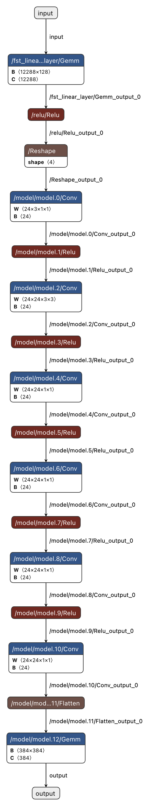

# VNN-COMP 2025 Benchmark: SoundnessBench 

This repository provides **SoundnessBench**, a benchmark for the [VNN-COMP 2025](https://sites.google.com/view/vnn2025) competition, inspired by the [paper](https://arxiv.org/abs/2412.03154) on creating tests for NN Verifiers.


The benchmark is designed to be **simple and easy to use**. It includes a single model with minimal architecture and standard operators already supported by most mainstream verifiers:

- Fully connected (linear) layers
- 2D convolutional layers
- ReLU activations
- Reshaping and flattening between 2D and 1D formats

The visualization of the benchmark model is shown below and in the [**figure**](./static/model.png), as a **simple feedforward** neural network (the "Gemm" layers are the fully-connected layers). Compared to the models in the original paper, this model architecture has been greatly simplified, with **NO complex architectures like ViT and NO non-ReLU activations.**


## Generating specifications
To generate property specifications following the standard format required by VNN-COMP 2025, use the following command:

```bash
python generate_properties.py <seed>
```


<!-- show the figure -->
## Model Visualization
<p align="center">
<a href="./static/model.png">

</a>
</p>
